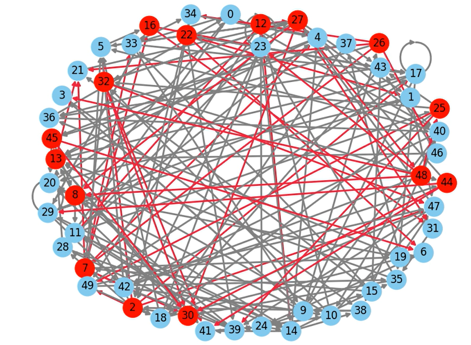

# 🔍 Smart Grid Anomaly Detection & Fake Edge Visualization

This project focuses on detecting anomalies in smart grid networks using graph-based techniques and visualizing **fake edges** (anomalous connections) with animated network graphs.

## 📁 Project Structure

```
.
├── .gitignore
├── README.md
├── smart_grid_dataset.csv          # Original smart grid dataset
├── upload_dataset_2.txt            # Script to load and prepare dataset
├── dependencies_1.txt              # Required libraries and environment setup
├── load_and_simulate_3.txt        # Graph loading and node/edge simulation
├── gnn_model_4.txt                 # GNN model definition
├── train_5.txt                     # Model training logic
├── model_eval_6.txt                # Model evaluation and metrics
├── detect_7.txt                    # Detect anomaly edges
├── animate_fake_edges_8.txt       # Animated visualization for anomaly edges
├── visualize_9.txt                # Static visualizations
├── save_video_10.txt              # Script to export animation to MP4
├── download_mp4_11.txt            # Script to download animation from Colab
```

---

## 📊 Dataset

- **Input**: `smart_grid_dataset.csv`
- Each **row** represents a **node** in the graph.
- Columns include:
  - **Node features** (e.g., voltage, current, frequency, etc.)
  - **Label** (`0`: normal, `1`: anomaly)


---

## 🧠 Model Pipeline

### 1. 📥 Dataset Upload & Preparation  
_Script: `upload_dataset_2.txt`_
- Load the smart grid dataset from CSV.
- Convert into `torch_geometric.data.Data` format.
- Extract node features and labels for anomaly classification.

### 2. 🔄 Graph Construction  
_Script: `load_and_simulate_3.txt`_
- Construct edges between nodes (e.g., similarity, correlation).
- Create `edge_index` required by PyTorch Geometric.
- Store as `DiGraph` for directional relationships.

### 3. 🧠 GNN Model Definition  
_Script: `gnn_model_4.txt`_
- Define a GNN model (e.g., GCN or GAT) using `torch.nn.Module`.
- Supports forward propagation over graph structure.

### 4. 🏋️ Model Training  
_Script: `train_5.txt`_
- Train on node classification using labeled anomaly data.
- Binary Cross-Entropy or BCEWithLogitsLoss as the loss function.

### 5. 📊 Evaluation  
_Script: `model_eval_6.txt`_
- Evaluate performance using classification metrics:
  - Accuracy
  - Precision/Recall
  - ROC-AUC

### 6. 🕵️ Anomaly Detection  
_Script: `detect_7.txt`_
- Predict anomaly scores for each node.
- Identify fake edges: `edge[i]` is fake if it connects to an anomalous node.
- Create a `fake_edge_mask` for visualization.

### 7. 🎨 Visualization & Animation  
_Scripts: `animate_fake_edges_8.txt`, `visualize_9.txt`_
- Visualize 60 nodes (top 40 normal + top 20 anomalous).
- Draw static normal edges (gray).
- Animate fake edges progressively in red using `matplotlib.animation`.

### 8. 🎞️ Save Animation  
_Script: `save_video_10.txt`_
- Save animated plot as `fake_edges_animation.mp4` using FFMPEG.

### 9. ⬇️ Download Output  
_Script: `download_mp4_11.txt`_
- Provide download link or command in Google Colab to download the MP4.

---

## 🛠️ Installation

```bash
pip install torch torchvision torchaudio
pip install torch-geometric
pip install networkx matplotlib

---

## ▶️ Running the Animation in Google Colab

```python
# Save the animation as an MP4
anim.save("fake_edges_animation.mp4", writer="ffmpeg", fps=2)

# Download from Colab
from google.colab import files
files.download("/content/fake_edges_animation.mp4")
```

---

## 📦 Requirements

```bash
pip install torch torchvision torchaudio torch-geometric
pip install matplotlib networkx pandas scikit-learn
```

---

## 📽️ Output Example



---

## 📄 License

This project is open-source under the MIT License.
